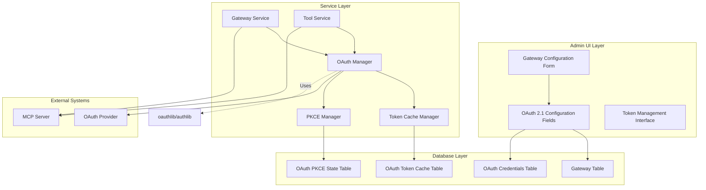
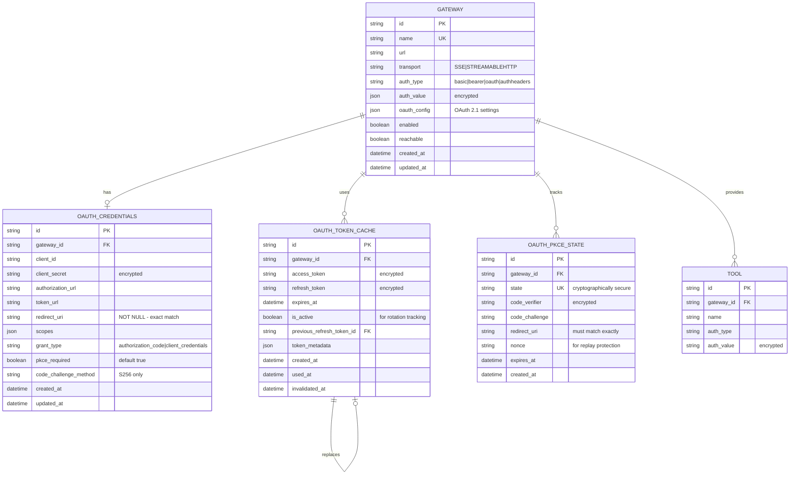
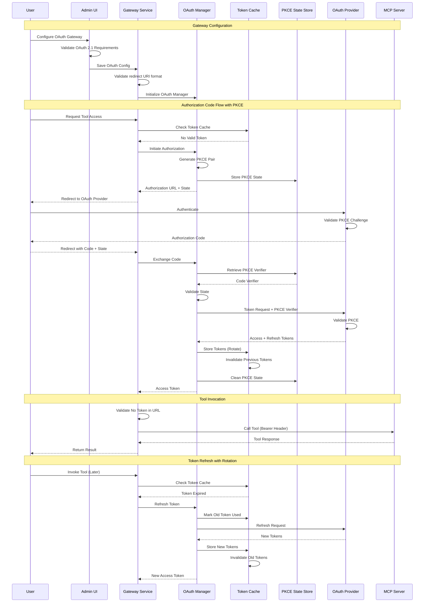

# OAuth 2.1 Integration Design for MCP Gateway

**Version**: 3.0 (Unified)
**Status**: Draft
**Author**: MCP Gateway Team
**Date**: December 2024

## Table of Contents

1. [Executive Summary](#executive-summary)
2. [Quick Reference: OAuth 2.1 Changes](#quick-reference-oauth-21-changes)
3. [Motivation](#motivation)
4. [Architecture Overview](#architecture-overview)
5. [OAuth 2.1 Specific Requirements](#oauth-21-specific-requirements)
6. [Database Schema Design](#database-schema-design)
7. [Component Design](#component-design)
8. [Implementation Flow](#implementation-flow)
9. [Key Implementation Details](#key-implementation-details)
10. [Security Considerations](#security-considerations)
11. [Configuration](#configuration)
12. [Migration Strategy](#migration-strategy)
13. [Testing Strategy](#testing-strategy)
14. [Rollout Plan](#rollout-plan)
15. [Dependencies](#dependencies)
16. [Example Usage](#example-usage)
17. [Monitoring and Observability](#monitoring-and-observability)
18. [Security Best Practices](#security-best-practices)
19. [Future Enhancements](#future-enhancements)
20. [Conclusion](#conclusion)

## Executive Summary

This document provides a comprehensive design for integrating OAuth 2.1 authentication into the MCP Gateway, enabling agents to perform actions on behalf of users without requiring personal access tokens (PATs). The implementation adheres to OAuth 2.1's enhanced security standards, including mandatory PKCE for all clients, strict redirect URI matching, one-time refresh tokens, and prohibition of bearer tokens in URLs.

## Quick Reference: OAuth 2.1 Changes

### Key Differences from OAuth 2.0

| Feature | OAuth 2.0 | OAuth 2.1 | Impact |
|---------|-----------|-----------|---------|
| **PKCE** | Optional for confidential clients | **Mandatory for ALL clients** | Must implement code_verifier/challenge |
| **Implicit Flow** | Supported | **Completely removed** | Use Authorization Code + PKCE |
| **Resource Owner Password** | Supported | **Strongly discouraged** | Avoid implementation |
| **Redirect URI Matching** | Partial matches allowed | **Exact string match only** | No wildcards permitted |
| **Refresh Tokens** | Can be reused | **One-time use only** | Automatic rotation required |
| **Bearer Tokens in URLs** | Allowed | **Prohibited** | Must use Authorization header |

### Implementation Checklist

- [ ] Implement PKCE with S256 for all authorization code flows
- [ ] Remove support for implicit grant flow
- [ ] Implement exact redirect URI validation
- [ ] Add refresh token rotation with immediate invalidation
- [ ] Validate no bearer tokens in URLs
- [ ] Update database schema for OAuth 2.1 requirements
- [ ] Implement OAuth Manager with PKCE support
- [ ] Create Token Cache Manager with rotation
- [ ] Update Admin UI for OAuth 2.1 configuration
- [ ] Modify gateway and tool services for OAuth 2.1

## Motivation

Current limitations of MCP Gateway authentication:

1. **Security Risk**: Personal Access Tokens (PATs) provide broad access and must be carefully managed
2. **User Experience**: Users must manually create and manage tokens for each service
3. **Scalability**: Managing multiple PATs across different services becomes cumbersome
4. **Delegation**: No native support for agents acting on behalf of users with scoped permissions

OAuth 2.1 addresses these concerns by providing:
- Enhanced security with mandatory PKCE for all clients
- Removal of vulnerable flows (implicit, ROPC)
- Scoped access control with principle of least privilege
- Secure token refresh with mandatory rotation
- Better security through short-lived access tokens
- Prohibition of bearer tokens in URLs

## Architecture Overview



## OAuth 2.1 Specific Requirements

### Implementation Challenges

1. **Library Support**: Not all OAuth libraries fully support OAuth 2.1 yet
   - `oauthlib` may need patches or extensions
   - Consider `authlib` which has better OAuth 2.1 support
   - May need to implement custom PKCE handling

2. **Provider Compatibility**: Some OAuth providers may not fully support OAuth 2.1
   - GitHub, Google, and modern providers generally support PKCE
   - Legacy enterprise systems may need adaptation layer

3. **Breaking Changes**: OAuth 2.1 is not backward compatible
   - Existing OAuth 2.0 integrations will need updates
   - Cannot support both OAuth 2.0 and 2.1 simultaneously for same flow

4. **Performance Considerations**:
   - Token rotation adds database operations
   - PKCE adds computational overhead (minimal)
   - State management requires additional storage

### Mandatory Requirements

1. **PKCE (Proof Key for Code Exchange)**
   - Required for ALL OAuth clients, including confidential clients
   - Must use S256 (SHA-256) challenge method
   - Code verifier length: 43-128 characters

2. **Grant Type Restrictions**
   - Only Authorization Code (with PKCE) and Client Credentials allowed
   - Implicit Grant flow completely removed
   - Resource Owner Password Credentials strongly discouraged

3. **Security Enhancements**
   - Exact redirect URI matching (no wildcards)
   - One-time use refresh tokens with rotation
   - No bearer tokens in URL query strings or fragments
   - Mandatory HTTPS for all OAuth endpoints

## Database Schema Design

### Complete Schema Overview



### SQL Schema Definitions

```sql
-- OAuth Credentials Table
CREATE TABLE oauth_credentials (
    id VARCHAR(36) PRIMARY KEY DEFAULT gen_random_uuid(),
    gateway_id VARCHAR(36) REFERENCES gateways(id) ON DELETE CASCADE,
    client_id VARCHAR(255) NOT NULL,
    client_secret TEXT, -- Encrypted with AES-256-GCM
    authorization_url TEXT,
    token_url TEXT NOT NULL,
    redirect_uri TEXT NOT NULL, -- OAuth 2.1: Exact match required
    scopes JSON DEFAULT '[]',
    grant_type VARCHAR(50) DEFAULT 'authorization_code',
    pkce_required BOOLEAN DEFAULT TRUE, -- OAuth 2.1: Always true
    code_challenge_method VARCHAR(10) DEFAULT 'S256', -- OAuth 2.1: Only S256
    created_at TIMESTAMP WITH TIME ZONE DEFAULT NOW(),
    updated_at TIMESTAMP WITH TIME ZONE DEFAULT NOW(),
    UNIQUE(gateway_id),
    CHECK (grant_type IN ('authorization_code', 'client_credentials')),
    CHECK (code_challenge_method = 'S256')
);

-- PKCE State Table
CREATE TABLE oauth_pkce_state (
    id VARCHAR(36) PRIMARY KEY DEFAULT gen_random_uuid(),
    gateway_id VARCHAR(36) REFERENCES gateways(id) ON DELETE CASCADE,
    state VARCHAR(255) UNIQUE NOT NULL,
    code_verifier VARCHAR(128) NOT NULL, -- Encrypted
    code_challenge VARCHAR(128) NOT NULL,
    redirect_uri TEXT NOT NULL,
    nonce VARCHAR(255), -- For OpenID Connect
    expires_at TIMESTAMP WITH TIME ZONE NOT NULL,
    created_at TIMESTAMP WITH TIME ZONE DEFAULT NOW(),
    INDEX idx_state_expires (state, expires_at),
    INDEX idx_gateway_state (gateway_id, state)
);

-- Token Cache Table with Rotation Support
CREATE TABLE oauth_token_cache (
    id VARCHAR(36) PRIMARY KEY DEFAULT gen_random_uuid(),
    gateway_id VARCHAR(36) REFERENCES gateways(id) ON DELETE CASCADE,
    access_token TEXT NOT NULL, -- Encrypted
    refresh_token TEXT, -- Encrypted
    expires_at TIMESTAMP WITH TIME ZONE,
    is_active BOOLEAN DEFAULT TRUE,
    previous_refresh_token_id VARCHAR(36) REFERENCES oauth_token_cache(id),
    token_metadata JSON,
    created_at TIMESTAMP WITH TIME ZONE DEFAULT NOW(),
    used_at TIMESTAMP WITH TIME ZONE,
    invalidated_at TIMESTAMP WITH TIME ZONE,
    INDEX idx_gateway_active (gateway_id, is_active),
    INDEX idx_expires (expires_at),
    INDEX idx_refresh_token (refresh_token) -- For rotation lookup
);
```

## Component Design

### 1. OAuth Manager Service

**Location**: `mcpgateway/services/oauth_manager.py`

```python
from oauthlib.oauth2 import BackendApplicationClient, WebApplicationClient
from requests_oauthlib import OAuth2Session
from typing import Optional, Dict, Any, Tuple
import secrets
import hashlib
import base64
import time

class OAuthManager:
    """Manages OAuth 2.1 authentication flows with mandatory PKCE."""

    def __init__(self, cache_manager: TokenCacheManager, db_session):
        self.cache_manager = cache_manager
        self.db = db_session

    async def get_access_token(
        self,
        gateway_id: str,
        credentials: OAuthCredentials
    ) -> str:
        """Get valid access token, refreshing if necessary."""
        # Check cache first
        cached_token = await self.cache_manager.get_token(gateway_id)
        if cached_token and not self._is_expired(cached_token):
            return cached_token.access_token

        # Token expired or not found
        if cached_token and cached_token.refresh_token:
            return await self.refresh_token(
                cached_token.refresh_token,
                credentials
            )
        else:
            # Need new authorization
            return await self.initiate_authorization(credentials)

    async def initiate_authorization(
        self,
        credentials: OAuthCredentials
    ) -> Dict[str, str]:
        """Start OAuth 2.1 authorization with PKCE."""
        # Generate PKCE parameters
        code_verifier, code_challenge = self.generate_pkce_pair()

        # Generate secure state
        state = secrets.token_urlsafe(32)

        # Store PKCE state
        await self._store_pkce_state(
            credentials.gateway_id,
            state,
            code_verifier,
            code_challenge,
            credentials.redirect_uri
        )

        # Build authorization URL
        auth_params = {
            'response_type': 'code',
            'client_id': credentials.client_id,
            'redirect_uri': credentials.redirect_uri,
            'scope': ' '.join(credentials.scopes),
            'state': state,
            'code_challenge': code_challenge,
            'code_challenge_method': 'S256'
        }

        return {
            'authorization_url': self._build_auth_url(
                credentials.authorization_url,
                auth_params
            ),
            'state': state
        }

    async def exchange_code(
        self,
        code: str,
        state: str,
        credentials: OAuthCredentials
    ) -> TokenResponse:
        """Exchange authorization code for tokens with PKCE verification."""
        # Retrieve and validate PKCE state
        pkce_state = await self._get_pkce_state(state)
        if not pkce_state:
            raise ValueError("Invalid or expired state")

        # Validate redirect URI exact match
        if pkce_state.redirect_uri != credentials.redirect_uri:
            raise ValueError("OAuth 2.1: Redirect URI must match exactly")

        # Exchange code for tokens
        token_data = {
            'grant_type': 'authorization_code',
            'code': code,
            'redirect_uri': credentials.redirect_uri,
            'code_verifier': pkce_state.code_verifier,
            'client_id': credentials.client_id,
            'client_secret': credentials.client_secret
        }

        response = await self._request_token(
            credentials.token_url,
            token_data
        )

        # Store tokens with rotation tracking
        await self.cache_manager.store_token(
            credentials.gateway_id,
            response,
            invalidate_previous=True
        )

        # Clean up PKCE state
        await self._delete_pkce_state(state)

        return response

    async def refresh_token(
        self,
        refresh_token: str,
        credentials: OAuthCredentials
    ) -> TokenResponse:
        """OAuth 2.1: Refresh with mandatory rotation."""
        # Immediately invalidate old refresh token
        await self.cache_manager.invalidate_refresh_token(refresh_token)

        token_data = {
            'grant_type': 'refresh_token',
            'refresh_token': refresh_token,
            'client_id': credentials.client_id,
            'client_secret': credentials.client_secret
        }

        response = await self._request_token(
            credentials.token_url,
            token_data
        )

        # Store new tokens, invalidating all previous
        await self.cache_manager.store_token(
            credentials.gateway_id,
            response,
            invalidate_previous=True
        )

        return response

    def generate_pkce_pair(self) -> Tuple[str, str]:
        """Generate PKCE code verifier and challenge (S256)."""
        # Generate cryptographically secure verifier
        code_verifier = base64.urlsafe_b64encode(
            secrets.token_bytes(64)  # 96 chars after encoding
        ).decode('utf-8').rstrip('=')

        # Create S256 challenge
        code_challenge = base64.urlsafe_b64encode(
            hashlib.sha256(code_verifier.encode('utf-8')).digest()
        ).decode('utf-8').rstrip('=')

        return code_verifier, code_challenge

    def validate_redirect_uri(
        self,
        requested_uri: str,
        registered_uri: str
    ) -> bool:
        """OAuth 2.1: Exact string match for redirect URIs."""
        return requested_uri == registered_uri

    def validate_token_url(self, url: str) -> bool:
        """OAuth 2.1: Ensure no tokens in URLs."""
        forbidden_params = ['access_token', 'refresh_token', 'token']
        parsed = urlparse(url)

        # Check query string
        if parsed.query:
            params = parse_qs(parsed.query)
            for forbidden in forbidden_params:
                if forbidden in params:
                    return False

        # Check fragment
        if parsed.fragment:
            for forbidden in forbidden_params:
                if forbidden in parsed.fragment:
                    return False

        return True
```

### 2. Token Cache Manager

**Location**: `mcpgateway/services/token_cache_manager.py`

```python
from cryptography.fernet import Fernet
from datetime import datetime, timedelta, timezone
import json

class TokenCacheManager:
    """OAuth 2.1 token cache with rotation and encryption."""

    def __init__(self, db_session, encryption_key: bytes):
        self.db = db_session
        self.cipher = Fernet(encryption_key)

    async def get_token(self, gateway_id: str) -> Optional[OAuthToken]:
        """Get active token if valid."""
        token = self.db.query(OAuthTokenCache).filter(
            OAuthTokenCache.gateway_id == gateway_id,
            OAuthTokenCache.is_active == True,
            OAuthTokenCache.invalidated_at.is_(None)
        ).first()

        if not token:
            return None

        # Check expiration
        if token.expires_at and token.expires_at < datetime.now(timezone.utc):
            await self.invalidate_token(gateway_id)
            return None

        # Decrypt tokens
        return OAuthToken(
            access_token=self._decrypt(token.access_token),
            refresh_token=self._decrypt(token.refresh_token) if token.refresh_token else None,
            expires_at=token.expires_at,
            metadata=token.token_metadata
        )

    async def store_token(
        self,
        gateway_id: str,
        token: TokenResponse,
        invalidate_previous: bool = True
    ) -> None:
        """Store token with OAuth 2.1 rotation support."""
        if invalidate_previous:
            # Invalidate all previous tokens for this gateway
            await self.invalidate_all_tokens(gateway_id)

        # Calculate expiration
        expires_at = datetime.now(timezone.utc) + timedelta(
            seconds=token.expires_in
        ) if token.expires_in else None

        # Get previous token ID for rotation tracking
        previous_token = self.db.query(OAuthTokenCache).filter(
            OAuthTokenCache.gateway_id == gateway_id,
            OAuthTokenCache.is_active == True
        ).first()

        # Create new token entry
        new_token = OAuthTokenCache(
            gateway_id=gateway_id,
            access_token=self._encrypt(token.access_token),
            refresh_token=self._encrypt(token.refresh_token) if token.refresh_token else None,
            expires_at=expires_at,
            is_active=True,
            previous_refresh_token_id=previous_token.id if previous_token else None,
            token_metadata={
                'token_type': token.token_type,
                'scope': token.scope,
                'issued_at': datetime.now(timezone.utc).isoformat()
            }
        )

        self.db.add(new_token)
        self.db.commit()

    async def invalidate_refresh_token(self, refresh_token: str) -> None:
        """OAuth 2.1: Immediately invalidate used refresh token."""
        encrypted_token = self._encrypt(refresh_token)

        token_entry = self.db.query(OAuthTokenCache).filter(
            OAuthTokenCache.refresh_token == encrypted_token,
            OAuthTokenCache.is_active == True
        ).first()

        if token_entry:
            token_entry.is_active = False
            token_entry.invalidated_at = datetime.now(timezone.utc)
            self.db.commit()

    async def invalidate_all_tokens(self, gateway_id: str) -> None:
        """Invalidate all tokens for rotation."""
        self.db.query(OAuthTokenCache).filter(
            OAuthTokenCache.gateway_id == gateway_id,
            OAuthTokenCache.is_active == True
        ).update({
            'is_active': False,
            'invalidated_at': datetime.now(timezone.utc)
        })
        self.db.commit()

    def _encrypt(self, data: str) -> str:
        """Encrypt sensitive data."""
        return self.cipher.encrypt(data.encode()).decode()

    def _decrypt(self, data: str) -> str:
        """Decrypt sensitive data."""
        return self.cipher.decrypt(data.encode()).decode()
```

### 3. Admin UI Enhancements

**OAuth 2.1 Configuration Form Fields**:

```html
<div id="auth-oauth-fields" class="oauth-21-config" style="display: none">
  <!-- OAuth 2.1 Notice -->
  <div class="alert alert-info oauth-21-notice">
    <h4>⚠️ OAuth 2.1 Security Requirements</h4>
    <ul>
      <li>✓ PKCE is mandatory for all clients (including confidential)</li>
      <li>✓ Redirect URI must match exactly (no wildcards)</li>
      <li>✓ Refresh tokens are single-use with automatic rotation</li>
      <li>✓ Bearer tokens cannot be passed in URLs</li>
      <li>✗ Implicit flow is not supported</li>
      <li>✗ Resource Owner Password flow is not supported</li>
    </ul>
  </div>

  <!-- Grant Type Selection -->
  <div class="form-group">
    <label for="oauth_grant_type">Grant Type*</label>
    <select name="oauth_grant_type" id="oauth_grant_type" class="form-control" required>
      <option value="">Select Grant Type</option>
      <option value="client_credentials">Client Credentials (M2M)</option>
      <option value="authorization_code">Authorization Code (User Delegation)</option>
    </select>
    <small class="form-text text-muted">
      Client Credentials for machine-to-machine, Authorization Code for user delegation
    </small>
  </div>

  <!-- Client Configuration -->
  <div class="form-group">
    <label for="oauth_client_id">Client ID*</label>
    <input type="text" name="oauth_client_id" id="oauth_client_id"
           class="form-control" required
           placeholder="your-oauth-client-id" />
  </div>

  <div class="form-group">
    <label for="oauth_client_secret">Client Secret*</label>
    <div class="input-group">
      <input type="password" name="oauth_client_secret" id="oauth_client_secret"
             class="form-control" required
             placeholder="your-oauth-client-secret" />
      <div class="input-group-append">
        <button class="btn btn-outline-secondary" type="button"
                onclick="togglePasswordVisibility('oauth_client_secret')">
          <i class="fas fa-eye"></i>
        </button>
      </div>
    </div>
    <small class="form-text text-muted">
      Stored encrypted with AES-256-GCM
    </small>
  </div>

  <!-- URLs -->
  <div class="form-group">
    <label for="oauth_token_url">Token URL*</label>
    <input type="url" name="oauth_token_url" id="oauth_token_url"
           class="form-control" required
           placeholder="https://provider.com/oauth/token" />
  </div>

  <div class="form-group" id="oauth-auth-url-group" style="display: none;">
    <label for="oauth_authorization_url">Authorization URL*</label>
    <input type="url" name="oauth_authorization_url" id="oauth_authorization_url"
           class="form-control"
           placeholder="https://provider.com/oauth/authorize" />
  </div>

  <div class="form-group" id="oauth-redirect-uri-group" style="display: none;">
    <label for="oauth_redirect_uri">Redirect URI*</label>
    <input type="url" name="oauth_redirect_uri" id="oauth_redirect_uri"
           class="form-control"
           placeholder="https://gateway.example.com/oauth/callback" />
    <small class="form-text text-warning">
      ⚠️ Must match EXACTLY with provider configuration (OAuth 2.1 requirement)
    </small>
  </div>

  <!-- Scopes -->
  <div class="form-group">
    <label for="oauth_scopes">Scopes</label>
    <input type="text" name="oauth_scopes" id="oauth_scopes"
           class="form-control"
           placeholder="read write profile" />
    <small class="form-text text-muted">
      Space-separated list of OAuth scopes
    </small>
  </div>

  <!-- OAuth 2.1 Settings (Read-only) -->
  <div class="form-group oauth-21-settings">
    <h5>OAuth 2.1 Mandatory Settings</h5>
    <div class="form-check">
      <input type="checkbox" class="form-check-input"
             id="oauth_pkce_required" checked disabled />
      <label class="form-check-label" for="oauth_pkce_required">
        PKCE Required (Always enabled for OAuth 2.1)
      </label>
    </div>
    <div class="form-check">
      <input type="checkbox" class="form-check-input"
             id="oauth_token_rotation" checked disabled />
      <label class="form-check-label" for="oauth_token_rotation">
        Refresh Token Rotation (Always enabled for OAuth 2.1)
      </label>
    </div>
    <div class="form-group mt-2">
      <label>Code Challenge Method</label>
      <input type="text" class="form-control" value="S256 (SHA-256)" readonly />
    </div>
  </div>

  <!-- Provider Templates -->
  <div class="form-group">
    <label>Quick Setup</label>
    <div class="btn-group btn-group-sm" role="group">
      <button type="button" class="btn btn-outline-primary"
              onclick="applyOAuthTemplate('github')">GitHub</button>
      <button type="button" class="btn btn-outline-primary"
              onclick="applyOAuthTemplate('google')">Google</button>
      <button type="button" class="btn btn-outline-primary"
              onclick="applyOAuthTemplate('azure')">Azure AD</button>
      <button type="button" class="btn btn-outline-primary"
              onclick="applyOAuthTemplate('okta')">Okta</button>
    </div>
  </div>
</div>

<script>
// Show/hide fields based on grant type
document.getElementById('oauth_grant_type').addEventListener('change', function(e) {
  const authUrlGroup = document.getElementById('oauth-auth-url-group');
  const redirectUriGroup = document.getElementById('oauth-redirect-uri-group');

  if (e.target.value === 'authorization_code') {
    authUrlGroup.style.display = 'block';
    redirectUriGroup.style.display = 'block';
    document.getElementById('oauth_authorization_url').required = true;
    document.getElementById('oauth_redirect_uri').required = true;
  } else {
    authUrlGroup.style.display = 'none';
    redirectUriGroup.style.display = 'none';
    document.getElementById('oauth_authorization_url').required = false;
    document.getElementById('oauth_redirect_uri').required = false;
  }
});

// OAuth provider templates
function applyOAuthTemplate(provider) {
  const templates = {
    github: {
      authorization_url: 'https://github.com/login/oauth/authorize',
      token_url: 'https://github.com/login/oauth/access_token',
      scopes: 'repo read:user'
    },
    google: {
      authorization_url: 'https://accounts.google.com/o/oauth2/v2/auth',
      token_url: 'https://oauth2.googleapis.com/token',
      scopes: 'openid email profile'
    },
    azure: {
      authorization_url: 'https://login.microsoftonline.com/{tenant}/oauth2/v2.0/authorize',
      token_url: 'https://login.microsoftonline.com/{tenant}/oauth2/v2.0/token',
      scopes: 'openid profile email'
    },
    okta: {
      authorization_url: 'https://{domain}/oauth2/v1/authorize',
      token_url: 'https://{domain}/oauth2/v1/token',
      scopes: 'openid profile email'
    }
  };

  const template = templates[provider];
  if (template) {
    if (template.authorization_url) {
      document.getElementById('oauth_authorization_url').value = template.authorization_url;
    }
    document.getElementById('oauth_token_url').value = template.token_url;
    document.getElementById('oauth_scopes').value = template.scopes;

    // Show alert for placeholders
    if (provider === 'azure' || provider === 'okta') {
      alert(`Remember to replace placeholders in URLs for ${provider}`);
    }
  }
}
</script>
```

## Implementation Flow

### OAuth 2.1 Complete Flow



## Key Implementation Details

### 1. Gateway Service Modifications

**File**: `mcpgateway/services/gateway_service.py`

```python
async def _initialize_gateway(
    self,
    url: str,
    authentication: Optional[Dict[str, str]] = None,
    transport: str = "SSE"
) -> tuple[Dict[str, Any], List[ToolCreate], List[ResourceCreate], List[PromptCreate]]:
    """Initialize gateway with OAuth 2.1 support."""

    # OAuth 2.1: Validate URL has no tokens
    if self._contains_bearer_token(url):
        raise ValueError(
            "OAuth 2.1 Security Violation: Bearer tokens must not be passed in URLs. "
            "Use Authorization header instead."
        )

    headers = {}

    if authentication and authentication.get('type') == 'oauth':
        # Get OAuth credentials
        credentials = await self._get_oauth_credentials(
            authentication['gateway_id']
        )

        # Validate redirect URI if present
        if hasattr(credentials, 'redirect_uri') and credentials.redirect_uri:
            parsed_url = urlparse(url)
            parsed_redirect = urlparse(credentials.redirect_uri)

            # OAuth 2.1: Exact match validation
            if parsed_url.scheme != parsed_redirect.scheme or \
               parsed_url.netloc != parsed_redirect.netloc or \
               parsed_url.path != parsed_redirect.path:
                raise ValueError(
                    f"OAuth 2.1: Redirect URI mismatch. "
                    f"Expected: {credentials.redirect_uri}, Got: {url}"
                )

        # Get access token
        try:
            access_token = await self.oauth_manager.get_access_token(
                gateway_id=authentication['gateway_id'],
                credentials=credentials
            )

            # OAuth 2.1: Always use Authorization header
            headers = {
                'Authorization': f'Bearer {access_token}',
                'X-OAuth-Version': '2.1'  # Indicate OAuth 2.1 compliance
            }
        except TokenExpiredError:
            # Handle expired token
            logger.warning(f"Token expired for gateway {authentication['gateway_id']}")
            raise GatewayConnectionError("OAuth token expired, re-authorization required")

    else:
        # Non-OAuth authentication
        headers = decode_auth(authentication)

    # Continue with connection...
    return await self._connect_to_gateway(url, headers, transport)

def _contains_bearer_token(self, url: str) -> bool:
    """Check if URL contains bearer tokens (OAuth 2.1 violation)."""
    parsed = urlparse(url)

    # Check query parameters
    if parsed.query:
        params = parse_qs(parsed.query.lower())
        token_params = ['access_token', 'bearer', 'token', 'auth']
        for param in token_params:
            if param in params:
                return True

    # Check fragment
    if parsed.fragment:
        fragment_lower = parsed.fragment.lower()
        if any(token in fragment_lower for token in ['access_token', 'bearer', 'token']):
            return True

    return False
```

### 2. Tool Service Modifications

**File**: `mcpgateway/services/tool_service.py`

```python
async def invoke_tool(
    self,
    db: Session,
    name: str,
    arguments: Dict[str, Any],
    request_headers: Optional[Dict[str, str]] = None
) -> ToolResult:
    """Invoke tool with OAuth 2.1 compliance."""

    tool = await self.get_tool_by_name(db, name)

    # OAuth 2.1: Pre-flight URL validation
    if tool.url and self._contains_bearer_token(tool.url):
        raise ToolValidationError(
            f"OAuth 2.1 Violation: Tool URL contains bearer token. "
            f"Tool: {name}, URL: {tool.url}"
        )

    headers = {}

    if tool.auth_type == 'oauth':
        gateway = tool.gateway
        if not gateway:
            raise ToolError(f"OAuth tool {name} has no associated gateway")

        # Get OAuth credentials
        credentials = await self._get_oauth_credentials(db, gateway.id)

        # Token acquisition with retry logic
        max_retries = 2
        for attempt in range(max_retries):
            try:
                # Get access token (handles refresh automatically)
                access_token = await self.oauth_manager.get_access_token(
                    gateway_id=gateway.id,
                    credentials=credentials
                )

                # OAuth 2.1: Bearer token in Authorization header only
                headers = {
                    'Authorization': f'Bearer {access_token}',
                    'X-Tool-Name': name,
                    'X-OAuth-Version': '2.1'
                }

                break

            except TokenExpiredError:
                if attempt == max_retries - 1:
                    raise
                # Token expired during processing, retry
                logger.info(f"Token expired during tool invocation, retrying... (attempt {attempt + 1})")
                await asyncio.sleep(0.5)

            except RefreshTokenExpiredError:
                # Refresh token expired, need re-authorization
                raise ToolError(
                    f"OAuth refresh token expired for tool {name}. "
                    "Re-authorization required."
                )
    else:
        # Non-OAuth authentication
        headers = self._get_tool_headers(tool)

    # OAuth 2.1: Final header validation
    self._validate_oauth_headers(headers)

    # Merge with request headers (OAuth headers take precedence)
    if request_headers:
        merged_headers = {**request_headers, **headers}
    else:
        merged_headers = headers

    # Execute tool with observability
    with create_span("tool.invoke.oauth21", {
        "tool.name": name,
        "tool.auth_type": tool.auth_type,
        "oauth.version": "2.1" if tool.auth_type == 'oauth' else None
    }) as span:
        try:
            result = await self._execute_tool(
                tool=tool,
                arguments=arguments,
                headers=merged_headers
            )

            if span:
                span.set_attribute("tool.success", True)

            return result

        except Exception as e:
            if span:
                span.set_attribute("tool.success", False)
                span.set_attribute("error.message", str(e))
            raise

def _validate_oauth_headers(self, headers: Dict[str, str]) -> None:
    """Validate OAuth 2.1 header compliance."""
    for key, value in headers.items():
        if key.lower() != 'authorization':
            # Check for tokens in other headers
            value_lower = value.lower()
            if any(token in value_lower for token in ['bearer', 'access_token', 'token']):
                logger.warning(
                    f"Potential OAuth 2.1 violation: Token-like value in header '{key}'. "
                    "Tokens should only be in Authorization header."
                )
```

## Security Considerations

### OAuth 2.1 Security Requirements

1. **Token Storage**
   - Use AES-256-GCM for all token encryption
   - Separate encryption keys for different token types
   - Key rotation every 90 days

2. **PKCE Implementation**
   - Code verifier: 43-128 characters (recommended: 96)
   - Use cryptographically secure random generation
   - S256 challenge method only

3. **Redirect URI Security**
   - Store as exact strings in database
   - Validate character-by-character match
   - No URL encoding differences allowed

4. **Refresh Token Rotation**
   - Immediate invalidation of used tokens
   - Track token lineage for audit
   - Maximum rotation chain length: 10

5. **Rate Limiting**
   - Authorization attempts: 5 per minute per client
   - Token requests: 10 per minute per client
   - Exponential backoff on failures

6. **Audit Logging**
   ```python
   # Required audit events
   - Authorization initiated
   - Authorization completed/failed
   - Token issued
   - Token refreshed
   - Token invalidated
   - Suspicious activity detected
   ```

## Configuration

### Environment Variables

```env
# OAuth 2.1 Configuration
OAUTH_ENABLE=true
OAUTH_VERSION=2.1

# Token Management
OAUTH_TOKEN_CACHE_TTL=3600          # Access token cache TTL (seconds)
OAUTH_REFRESH_TOKEN_TTL=604800      # Refresh token validity (7 days)
OAUTH_MAX_TOKEN_AGE=86400           # Maximum token age before forced refresh

# PKCE Configuration
OAUTH_PKCE_REQUIRED=true            # Always true for OAuth 2.1
OAUTH_PKCE_CODE_LENGTH=96           # Code verifier length (43-128)
OAUTH_PKCE_STATE_TTL=600            # Authorization state TTL (seconds)

# Security Settings
OAUTH_STRICT_REDIRECT_URI=true      # Always true for OAuth 2.1
OAUTH_REFRESH_TOKEN_ROTATION=true   # Always true for OAuth 2.1
OAUTH_ALLOW_HTTP=false              # HTTPS required for OAuth endpoints

# Rate Limiting
OAUTH_AUTH_RATE_LIMIT=5             # Auth attempts per minute
OAUTH_TOKEN_RATE_LIMIT=10           # Token requests per minute
OAUTH_RATE_LIMIT_WINDOW=60          # Rate limit window (seconds)

# Encryption
OAUTH_ENCRYPTION_KEY=${OAUTH_ENCRYPTION_KEY}  # Base64 encoded 32-byte key
OAUTH_KEY_ROTATION_DAYS=90          # Encryption key rotation period

# Monitoring
OAUTH_ENABLE_METRICS=true
OAUTH_ENABLE_AUDIT_LOG=true
OAUTH_AUDIT_LOG_RETENTION_DAYS=90
```

## Migration Strategy

### Phase 1: Database Schema (Week 1)

```sql
-- Migration script
BEGIN TRANSACTION;

-- Add OAuth config to gateways
ALTER TABLE gateways
ADD COLUMN oauth_config JSONB,
ADD COLUMN oauth_version VARCHAR(10) DEFAULT '2.1';

-- Create OAuth tables
CREATE TABLE oauth_credentials (...);
CREATE TABLE oauth_token_cache (...);
CREATE TABLE oauth_pkce_state (...);

-- Add indexes
CREATE INDEX idx_oauth_active_tokens ON oauth_token_cache(gateway_id, is_active);
CREATE INDEX idx_oauth_pkce_expiry ON oauth_pkce_state(expires_at);

-- Add constraints
ALTER TABLE oauth_credentials
ADD CONSTRAINT chk_oauth21_grant_type
CHECK (grant_type IN ('authorization_code', 'client_credentials'));

COMMIT;
```

### Phase 2: Service Implementation (Week 2-3)

1. Implement OAuth Manager with PKCE
2. Implement Token Cache Manager with rotation
3. Add OAuth support to Gateway Service
4. Add OAuth support to Tool Service
5. Create OAuth callback endpoints

### Phase 3: UI Integration (Week 4)

1. Update Admin UI with OAuth 2.1 forms
2. Add OAuth status dashboard
3. Implement authorization flow UI
4. Add token management interface

### Phase 4: Testing & Rollout (Week 5-6)

1. Unit tests for all OAuth components
2. Integration tests for complete flows
3. Security penetration testing
4. Performance testing under load
5. Documentation and training

## Testing Strategy

### Unit Tests

```python
# Test PKCE generation
def test_pkce_generation():
    manager = OAuthManager()
    verifier, challenge = manager.generate_pkce_pair()

    assert 43 <= len(verifier) <= 128
    assert len(challenge) == 43  # S256 produces 43 chars

    # Verify challenge calculation
    expected = base64.urlsafe_b64encode(
        hashlib.sha256(verifier.encode()).digest()
    ).decode().rstrip('=')

    assert challenge == expected

# Test redirect URI validation
def test_redirect_uri_validation():
    manager = OAuthManager()

    # Exact match - should pass
    assert manager.validate_redirect_uri(
        "https://app.com/callback",
        "https://app.com/callback"
    )

    # Different path - should fail
    assert not manager.validate_redirect_uri(
        "https://app.com/callback/auth",
        "https://app.com/callback"
    )

    # Different scheme - should fail
    assert not manager.validate_redirect_uri(
        "http://app.com/callback",
        "https://app.com/callback"
    )

# Test token rotation
async def test_refresh_token_rotation():
    cache = TokenCacheManager()

    # Store initial token
    await cache.store_token("gw1", initial_token)

    # Refresh should invalidate old token
    await cache.invalidate_refresh_token(initial_token.refresh_token)

    # Old token should be inactive
    old_token = await cache.get_token("gw1")
    assert old_token is None
```

### Integration Tests

```python
# Complete OAuth 2.1 flow test
async def test_oauth21_complete_flow():
    # Setup
    gateway = create_test_gateway(auth_type='oauth')
    oauth_creds = create_oauth_credentials(
        grant_type='authorization_code',
        pkce_required=True
    )

    # Step 1: Initiate authorization
    auth_result = await oauth_manager.initiate_authorization(oauth_creds)
    assert 'authorization_url' in auth_result
    assert 'code_challenge' in auth_result['authorization_url']

    # Step 2: Simulate authorization callback
    auth_code = "test_auth_code"
    token_result = await oauth_manager.exchange_code(
        code=auth_code,
        state=auth_result['state'],
        credentials=oauth_creds
    )

    assert token_result.access_token
    assert token_result.refresh_token

    # Step 3: Use token for tool invocation
    tool_result = await tool_service.invoke_tool(
        name="test_tool",
        arguments={"param": "value"}
    )

    assert tool_result.success

    # Step 4: Test token refresh
    # Expire the token
    await cache.expire_token(gateway.id)

    # Should automatically refresh
    tool_result2 = await tool_service.invoke_tool(
        name="test_tool",
        arguments={"param": "value2"}
    )

    assert tool_result2.success
```

### Security Tests

```python
# Test bearer token in URL rejection
def test_bearer_token_url_rejection():
    urls = [
        "https://api.com/endpoint?access_token=secret",
        "https://api.com/endpoint#access_token=secret",
        "https://api.com/endpoint?token=Bearer%20secret",
    ]

    for url in urls:
        with pytest.raises(ValueError, match="OAuth 2.1.*Bearer tokens.*URLs"):
            gateway_service._validate_url(url)

# Test token encryption
def test_token_encryption():
    cache = TokenCacheManager(encryption_key=test_key)

    token = "sensitive_access_token"
    encrypted = cache._encrypt(token)

    # Should not contain original token
    assert token not in encrypted

    # Should decrypt correctly
    decrypted = cache._decrypt(encrypted)
    assert decrypted == token
```

## Example Usage

### Configuration Examples

#### GitHub with OAuth 2.1

```python
POST /gateways
{
    "name": "GitHub MCP Server",
    "url": "https://github-mcp.example.com/sse",
    "transport": "streamablehttp",
    "auth_type": "oauth",
    "oauth_config": {
        "grant_type": "authorization_code",
        "client_id": "github_app_client_id",
        "client_secret": "github_app_client_secret",
        "authorization_url": "https://github.com/login/oauth/authorize",
        "token_url": "https://github.com/login/oauth/access_token",
        "redirect_uri": "https://gateway.example.com/oauth/github/callback",
        "scopes": ["repo", "read:user", "project"],
        "pkce_required": true,
        "code_challenge_method": "S256"
    }
}
```

#### Google Workspace Integration

```python
POST /gateways
{
    "name": "Google Workspace MCP",
    "url": "https://workspace-mcp.example.com/sse",
    "transport": "sse",
    "auth_type": "oauth",
    "oauth_config": {
        "grant_type": "authorization_code",
        "client_id": "google_client_id.apps.googleusercontent.com",
        "client_secret": "google_client_secret",
        "authorization_url": "https://accounts.google.com/o/oauth2/v2/auth",
        "token_url": "https://oauth2.googleapis.com/token",
        "redirect_uri": "https://gateway.example.com/oauth/google/callback",
        "scopes": [
            "https://www.googleapis.com/auth/drive.readonly",
            "https://www.googleapis.com/auth/gmail.readonly"
        ],
        "pkce_required": true,
        "additional_params": {
            "access_type": "offline",
            "prompt": "consent"
        }
    }
}
```

### Tool Invocation

```python
# Automatic OAuth token management
result = await tool_service.invoke_tool(
    db=db,
    name="github_create_pr",
    arguments={
        "repository": "org/repo",
        "title": "Feature: OAuth 2.1 Support",
        "body": "Implements OAuth 2.1 compliance",
        "base": "main",
        "head": "feature/oauth21"
    }
)

# The service handles:
# 1. Token acquisition (if needed)
# 2. Token refresh (if expired)
# 3. Retry logic for token expiration
# 4. OAuth 2.1 compliance validation
```

## Monitoring and Observability

### Metrics

```python
# OAuth 2.1 specific metrics
oauth_metrics = {
    # Performance
    "oauth.token_request.duration": histogram,
    "oauth.token_cache.hit_rate": gauge,
    "oauth.pkce_generation.duration": histogram,

    # Security
    "oauth.auth_failures.total": counter,
    "oauth.token_rotation.count": counter,
    "oauth.redirect_uri_mismatches": counter,
    "oauth.bearer_in_url_attempts": counter,

    # Usage
    "oauth.active_tokens.count": gauge,
    "oauth.refresh_operations.total": counter,
    "oauth.grant_type.usage": counter(labels=["grant_type"])
}
```

### OpenTelemetry Spans

```python
# OAuth flow tracing
with create_span("oauth.authorization_flow", {
    "oauth.version": "2.1",
    "oauth.grant_type": grant_type,
    "oauth.provider": provider_name,
    "oauth.pkce_enabled": True
}) as span:
    # Authorization logic
    span.add_event("pkce_generated")
    span.add_event("authorization_initiated")

    # ... authorization process ...

    span.set_attribute("oauth.scopes_requested", len(scopes))
    span.set_attribute("oauth.success", success)
```

### Audit Events

```json
{
    "timestamp": "2024-12-10T10:30:45Z",
    "event_type": "oauth.token_refreshed",
    "gateway_id": "gw_123",
    "details": {
        "old_token_id": "tok_abc",
        "new_token_id": "tok_xyz",
        "rotation_number": 3,
        "client_id": "client_123",
        "ip_address": "192.168.1.100",
        "user_agent": "MCP-Gateway/2.0"
    }
}
```

## Security Best Practices

### OAuth 2.1 Compliance Checklist

- [x] PKCE mandatory for all authorization code flows
- [x] S256 code challenge method only
- [x] Exact redirect URI matching
- [x] One-time use refresh tokens
- [x] Automatic token rotation
- [x] No bearer tokens in URLs
- [x] No implicit grant flow support
- [x] No ROPC grant support
- [x] HTTPS required for all OAuth endpoints
- [x] State parameter validation
- [x] Nonce validation for OpenID Connect
- [x] Token binding support (optional)
- [x] DPoP support (future enhancement)

### Production Security Measures

1. **Infrastructure**
   - Use Hardware Security Module (HSM) for key storage
   - Deploy behind WAF with OAuth-specific rules
   - Enable comprehensive audit logging
   - Implement intrusion detection

2. **Monitoring**
   - Alert on unusual token patterns
   - Monitor for authorization anomalies
   - Track failed authentication attempts
   - Detect potential token replay attacks

3. **Compliance**
   - Regular security audits
   - Penetration testing
   - Compliance with GDPR/CCPA for token data
   - SOC 2 Type II certification considerations

## Future Enhancements

1. **Advanced Security**
   - DPoP (Demonstrating Proof of Possession) support
   - Certificate-bound access tokens
   - Mutual TLS for client authentication
   - Pushed Authorization Requests (PAR)

2. **Standards Support**
   - OpenID Connect full compliance
   - FAPI (Financial-grade API) support
   - JWT Secured Authorization Response Mode (JARM)
   - Rich Authorization Requests (RAR)

3. **User Experience**
   - OAuth provider auto-discovery
   - Simplified configuration wizards
   - Mobile app support with PKCE
   - Biometric authentication integration

4. **Operations**
   - Automated token lifecycle management
   - Self-service OAuth app registration
   - Multi-tenant OAuth isolation
   - Advanced analytics dashboard

## Conclusion

This comprehensive OAuth 2.1 integration design ensures that MCP Gateway implements the highest security standards for delegated authorization. By adopting OAuth 2.1's mandatory security features—including PKCE for all clients, strict redirect URI matching, one-time refresh tokens, and prohibition of bearer tokens in URLs—we create a robust and secure authentication system.

The implementation provides:
- **Enhanced Security**: Eliminates all known OAuth 2.0 vulnerabilities
- **Simplified Integration**: Fewer flows to support, clearer security model
- **Future-Proof Design**: Ready for emerging standards and extensions
- **Operational Excellence**: Comprehensive monitoring, auditing, and management

This design enables agents to securely act on behalf of users without the risks associated with personal access tokens, while maintaining backward compatibility where possible and providing a clear migration path for existing deployments.
